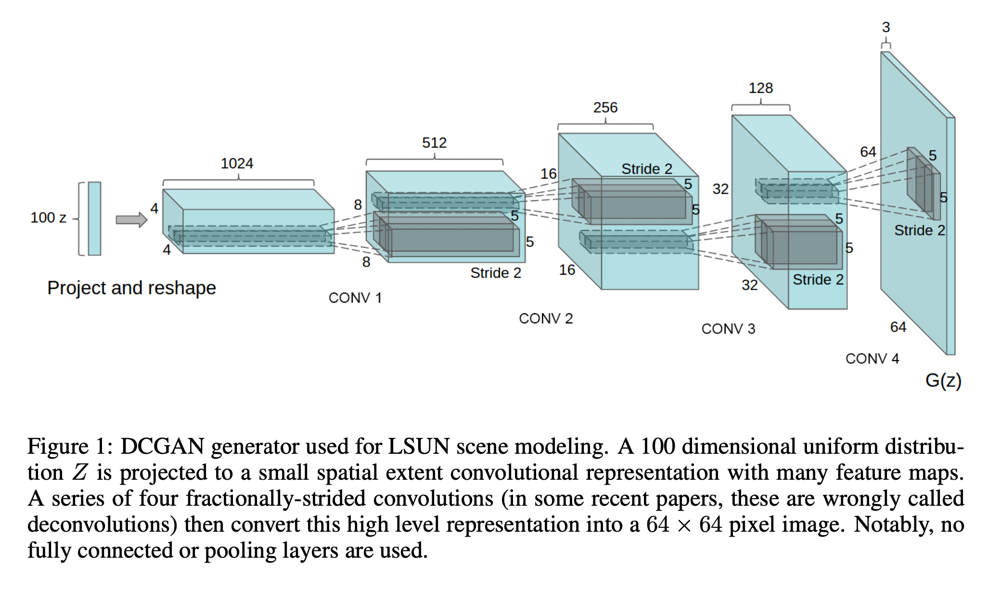
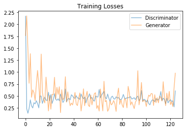
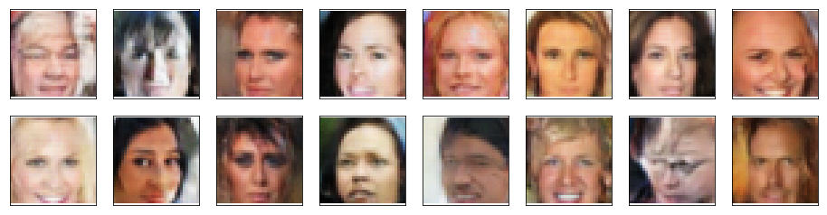

<h1 align="center">Generate Faces Using Deep Convolutional Generative Adversarial Networks (DCGAN)</h1>

## About the project

In this project, I defined and trained a DCGAN on a dataset of faces. The goal is to get a generator network to generate new images of faces that look as realistic as possible!

#### Get the Data

I have used the [CelebFaces Attributes Dataset (CelebA)](http://mmlab.ie.cuhk.edu.hk/projects/CelebA.html) to train the adversarial networks.


#### Pre-processed Data

Each of the CelebA images has been cropped to remove parts of the image that don't include a face, then resized down to 64x64x3 NumPy images. Some sample data is show below.


> You can download this data [by clicking here](https://s3.amazonaws.com/video.udacity-data.com/topher/2018/November/5be7eb6f_processed-celeba-small/processed-celeba-small.zip)

This is a zip file that you'll need to extract in the home directory of this notebook for further loading and processing. After extracting the data, you should be left with a directory of data `processed_celeba_small/`


### Network Architecture

The architecture used for the generator and the discriminator was inspired by the [original DCGAN paper](https://arxiv.org/pdf/1511.06434.pdf):



**I have also used the same hyperparameters mentioned in this paper.**

The loss functions was inspired by LSGAN paper.
> Binary cross entropy loss function may lead to the vanishing gradients problem during the learning process. To overcome such a problem, I've used a least squares loss function for the discriminator. This structure is also referred to as a least squares GAN or LSGAN, and you can [read the original paper on LSGANs, here](https://arxiv.org/pdf/1611.04076.pdf). The authors show that LSGANs are able to generate higher quality images than regular GANs and that this loss type is a bit more stable during training!

Finally the last layer of the discriminator was inspired by patchGAN. PatchGAN has fewer parameters, runs faster and classifies images as fake or real.
You can check about patchGAN in this paper: [Image-to-Image Translation with Conditional Adversarial Networks](https://arxiv.org/pdf/1611.07004.pdf).

### Results

You can see the value for losses below: 




Some of the generated faces after `25 epochs` have been shown below. As you can see, they're not the most realistic faces in the world, but I argue that they are fantastic, considering that :
1. I didn't put so much time experimenting with hyperparameters, 
2. The model is not very deep,
3. The number of epochs is relatively low, 
4. And the initial input is small.



## Getting Started


### Steps 


1. Clone the repo
   ```sh
   git clone https://github.com/salehsargolzaee/DCGAN-for-face-generation  
   ```

2. Make sure you've installed following packages:
	* PyTorch
	* NumPy
	* pickle
	* matplotlib
	
3. Change directory to repo folder
   ```sh
   cd path/to/repo/folder
   ```
4. Download the dataset, and place it in this project's home directory, at the location as explained above.


5. Run `jupyter notebook`
    
   ```sh
   jupyter notebook
   ```
6. Open `face_generation.ipynb`


## Contact 
<a id = "contact"></a>

Saleh Sargolzaee - [LinkedIn](https://www.linkedin.com/in/saleh-sargolzaee) - salehsargolzaee@gmail.com

Project Link: [https://github.com/salehsargolzaee/DCGAN-for-face-generation](https://github.com/salehsargolzaee/DCGAN-for-face-generation)

<p align="right">(<a href="#top">back to top</a>)</p>

## :man_astronaut: Show your support

Give a ⭐️ if you liked the project!


